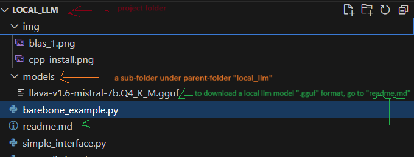
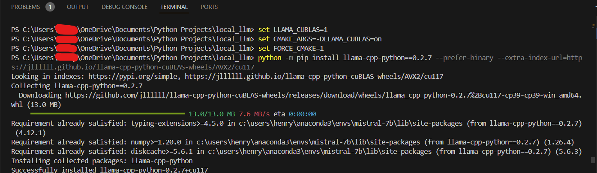
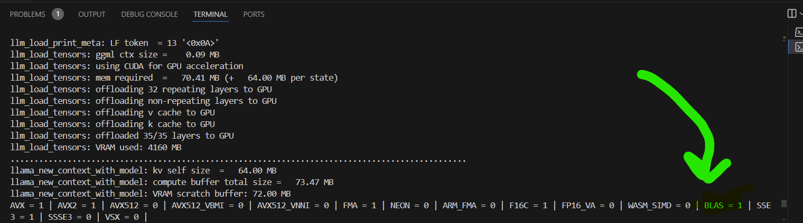

# Step 0: Download Your Language Model



Download your model from [Hugging Face](https://huggingface.co/cjpais/llava-1.6-mistral-7b-gguf/tree/main). For example, download `llava-v1.6-mistral-7b.Q4_K_M.gguf` and save it in the `models` folder under your project directory `local_llm`.

Alternatively, you can use the following code to download the model efficiently:

```python
from huggingface_hub import hf_hub_download

model_name = "cjpais/llava-1.6-mistral-7b-gguf"
model_file = "llava-v1.6-mistral-7b.Q4_K_M.gguf"
HF_TOKEN = "your_huggingface_token"  # Replace with your Hugging Face access token

model_path = hf_hub_download(model_name, filename=model_file, local_dir='models/', token=HF_TOKEN)
print("Model path:", model_path)
```

# Step 1: Install Necessary Tools in VS Code

- C++ CMake tools for Windows
- C++ core features
- Windows 10/11 SDK

# Step 2: Install CUDA Toolkit 11.7 and Verify Installation

Download and install [CUDA Toolkit 11.7](https://developer.nvidia.com/cuda-11-7-0-download-archive).

Verify the installation with `nvcc --version` and `nvidia-smi`.

Check if CUDA is enabled in PyTorch:

```python
import torch

# Install PyTorch if necessary:
# pip install torch torchvision torchaudio --index-url https://download.pytorch.org/whl/cu117

print('CUDA available:', torch.cuda.is_available())
print('Current CUDA device:', torch.cuda.current_device())
print('Number of GPUs:', torch.cuda.device_count())
print('CUDA device name:', torch.cuda.get_device_name(0))

import numpy as np
from numpy.distutils.system_info import get_info
print(np.__config__.show())

try:
    blas_info = get_info('blas_opt')
    print(blas_info)
except ImportError as e:
    print("Error importing numpy.distutils.system_info:", e)
```

## Verify GPU Information with `nvidia-smi`

Type **`nvidia-smi`** in the VS Code terminal:

- **Model**: NVIDIA GeForce RTX 3070
- **Driver Mode**: WDDM
- **PCI Address**: 00000000:01:00.0
- **Power State**: Off

### Temperature and Power
- **Temperature**: 49°C
- **Power Usage**: 29W / 135W (Max)

### Memory Usage
- **Total Memory**: 8192 MiB (8 GB)
- **Used Memory**: 0 MiB

### Processes
- **No running processes found**

## Verify CUDA Compiler Version with `nvcc --version`

```plaintext
nvcc: NVIDIA (R) Cuda compiler driver
Built on Tue_May__3_19:00:59_Pacific_Daylight_Time_2022
Cuda compilation tools, release 11.7, V11.7.64
Build cuda_11.7.r11.7/compiler.31294372_0
```

# Step 3: Install `llama_cpp` and Other Packages

In the VS Code terminal, run:

```bash
set LLAMA_CUBLAS=1
set CMAKE_ARGS=-DLLAMA_CUBLAS=on
set FORCE_CMAKE=1
python -m pip install llama-cpp-python==0.2.7 --prefer-binary --extra-index-url=https://jllllll.github.io/llama-cpp-python-cuBLAS-wheels/AVX2/cu117
```



Reference: [private-gpt issue 1242](https://github.com/zylon-ai/private-gpt/issues/1242)

# Step 4: Run Your Inference Pipeline and Check for BLAS=1

Ensure BLAS=1 appears in the output to confirm GPU acceleration. In experiments, inference time reduced from ~70 seconds to ~1-3 seconds due to GPU acceleration.



If you need to load a model larger than your VRAM, use these techniques:

- **Reduce Model Size**: Use a smaller model (e.g., 7B instead of 13B).
- **Optimize Model Loading**: Reduce layers offloaded to GPU.
  ```python
  llm = Llama(..., n_gpu_layers=20, ...)
  ```
- **Use Quantized Models**
- **Use Mixed Precision**:
  ```python
  llm = Llama(..., use_fp16=True)
  ```
- **Optimize Batch Size**:
  ```python
  output = llm(..., max_tokens=512)
  ```
